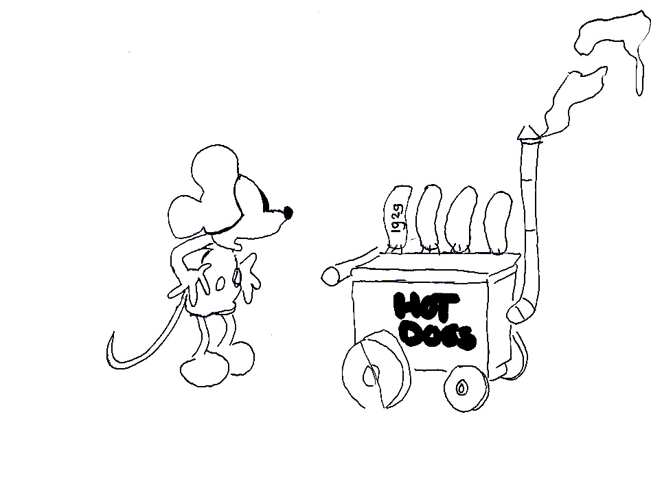
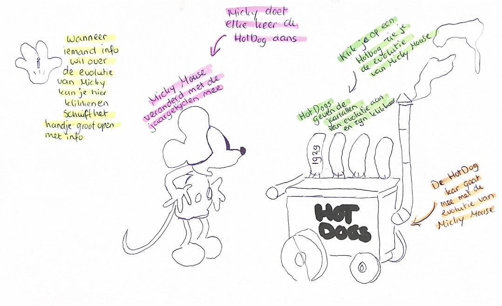
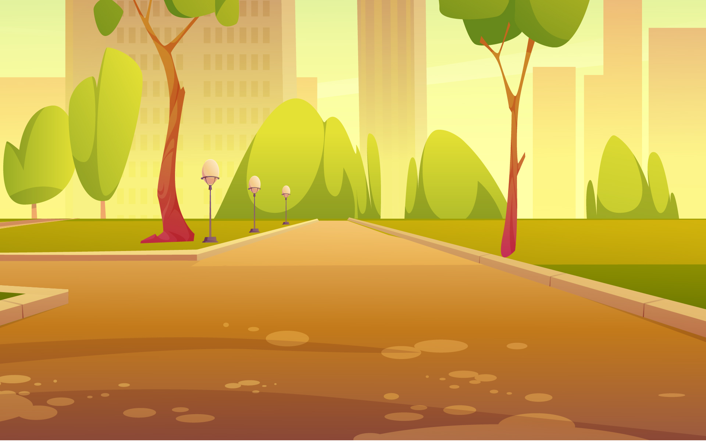
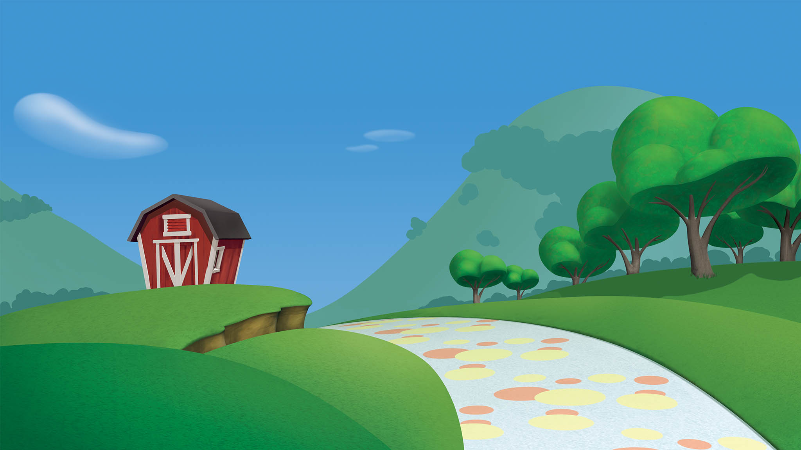
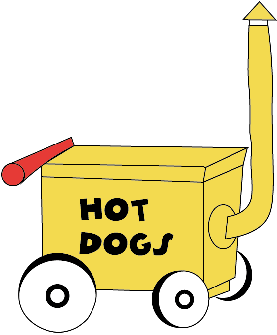
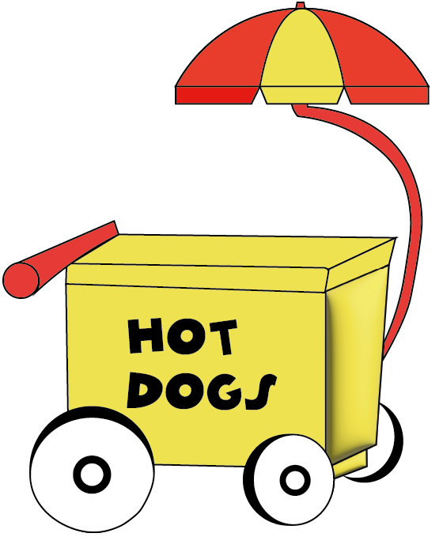
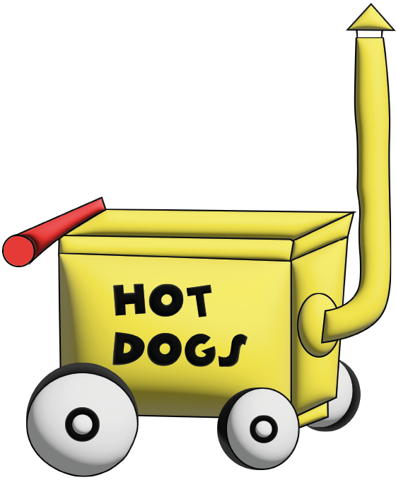
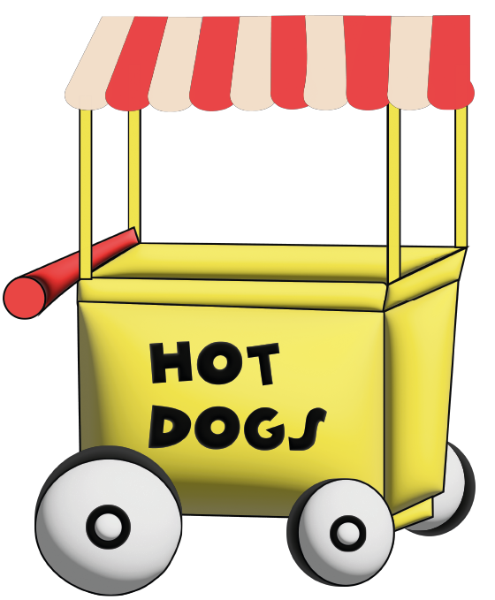
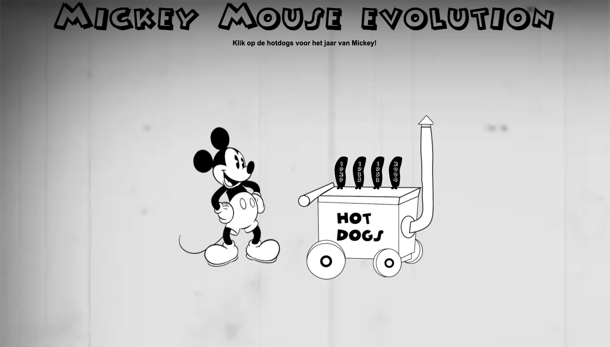

# Procesverslag

### Ontwerper:
Daphne Smits

#### Je startniveau:
Mijn startniveau is blauw. Voor mij is coderen geheel nieuw en heb ik er moeite mee. Ik vind het lastig om in een keer alles te begrijpen en daarnaast nog toe te bassen. Door de blauwe piste te kiezen kan ik goed de basis leren van HTML en CSS. 

# Je plan

  
De eerste versie/schets van je ontwerp & je persoonlijke uitdaging

  ### De eerste versie/schets:
  
  

  Door deskresearch te doen naar Mickey Mouse ben ik erachter gekomen dat Mickey zijn eerste woorden uitsprak in 1929, dit was het woord 'Hotdogs'. Op deze manier ben ik tot het idee gekomen om Mickey Mouse samen met zijn Hotdog kar door de jaren heen, op chronologische volgorde, weer te geven in mijn interface. De achtergrond van Mickey Mouse gaat ook met de jaren mee om de sfeergoed over te brengen naar de kijker.

  ### Je ambitie: 
  Aan deze technieken/punten wil ik werken:
  - punt 1: Mijn ideeën werkelijkheid maken door de basis van HTML en CSS toe te passen in mijn eigen werk.
  - punt 2: De basis begrijpen van HTML en CSS.
  - punt 3: Ik wil leren om een objecten te animeren.
 

## Voortgang/Feedback 1

  
Mijn bevindingen + wijzigingen (minimaal 5)

  Mijn 1e feedback moment heb ik gehad met Yarre, hij heeft mij anders laten kijken en tot ideeën gebracht.

  ### Bevinding 1:
  In de eerste instantie wilde ik Mikcey Mouse de Hotdog dans laren doen, maar dit is erg lastig bij een afbeelding. Een advies was om Mickey Mouse in het beeld te laten komen waneer er op een Hotdog geklikt wordt, zodat het niet saai stil blijft staan, maar een speelser effect krijgt. 

  #### oplossing:
  De oplossing die ik heb toegepast op deze bevinding is dat ik Mickey in het beeld laat springen wanneer er op een jaartal/Hotdog wordt geklikt

  ### Bevinding 2:
  Bij mijn eerste schets had ik alleen het idee om Mickey en de Hotdog kraam mee te veranderen met de evolutie. Om het een geheel te houden was een tip om de achtergrond ook per setting te laten veranderen. Dus van zwart wit naar kleur en 3D.

  #### oplossing:
  De oplossing voor dit advies was om voor elk jaartal een bijpassende achtergrond te zoeken. Zo heb ik in 1929 een 'Old Movie' setting gebruikt met behulp van een gif. In het jaar 1935 een kleur setting, maar nog niet gedetailleerd, 1953, ook kleur en wat specifieker en als laatste 2004 een 3D achtergrond. 

  ### Bevinding 3:
  Het handje op de schets met een 'I' erin zou informatie moeten geven, een idee was om op Mickey te klikken en zo informatie te laten zien in plaats van het hanje. 
 
  #### oplossing:
  Door Mickey een hover te geven en een 'talk bubble' eraan te linken weet de kijker dat Mickey klikbaar is. Wanneer de kijker klikt op Mickey zal er informatie tevoorschijn komen.

   

   ### Bevinding 4:
   Een tip van Yarre was om aan een landingspagina te denken. Hij zei dat het misschien leuk was om de kar in het beeld te laten rollen tot aan het midden (nog zonder Mickey), zodat vanaf hier de kijker een jaargetijde kiezen. Zo heb je een soort start scene. 
 
  #### oplossing:
  Hoewel ik dit een goed idee vond en ik me er in kon vinden heb ik ervoor gekozen om dit niet toe te passen, omdat ik de bovenstaande bevindingen voorrang vond hebben. Wanneer ik meer tijd zou hebben had ik hier graag nog wat aandacht aan besteed. 

   ### Bevinding 5:
  Omdat Mickey van Hotdogs houdt is het misschien leuk om er een audio aan toe te voegen als Mickey in komt springen en zegt 'Hotdogs'.
 
  #### oplossing:
  Aan deze bevinding was ik begonnen, maar helaas kon ik niet per jaargetijd een stem van ickey mouse vinden. Wel heb ik eraan gedacht om een audio fragment te gebruiken, maar uiteindelijk niet toegepast.

## Voortgang/Feedback 2

  
Mijn bevindingen + wijzigingen (minimaal 5)

  
  ### Bevinding 1:
  Interactieve elementen (links, buttons en inputs) kunnen met het toetsenbord (tab) nog niet geselecteerd worden.

  #### oplossing:
  De elementen kunnen met tab geselecteerd worden, maar helaas krijg ik het niet voor elkaar dat het met enter of soatie geactiveerd word. In het vervolg moet ik direct aanpassen nadat iemand dit als feedback geeft. Op deze manier kan k nog om hulp vragen.

  ### Bevinding 2:
  De states van interactieve elementen passen nog niet bij het onderwerp.

  #### oplossing:
  De states heb ik bij zowel de Hotdogs als Mickey, de klikbare elementen, toegepast. De state die ik bij beide heb toegepast is 'hover'.  Op deze manier ziet de kijker wanneer hij/zij over een element gaat wat wel of niet klikbaar is.

  

  ### Bevinding 3:
  CSS custom properties worden nog niet ingezet.

  #### oplossing:
  De CSS custom properties heb ik overal in CSS toegepast

  

  ### Bevinding 4:
  In mijn HTML stond 2x een main, terwijl er maar een main is met hoofd content.

  #### oplossing:
  Alle main content heb ik samen gevoegd in een main.

  ### Bevinding 5:
  HTML en CSS zijn nog niet volledig netjes ingesprongen ofvoldoende witruimte voor gebruikt.

  #### oplossing:
  De oplossing hiervoor was om dit op te schonen.

  
  

## Voortgang/Feedback 3

  
Mijn bevindingen + wijzigingen (minimaal 5)

  
  ### Bevinding 1:
  De teksten in de Hotdogs zijn in Illustrator gemaakt, hierdoor kan een persoon die blind is niet luisteren wat er staat. 

  #### oplossing:
  Voor nu had ik er te weinig tijd voor om dit op te lossen, in het vervolg zal ik hier meer op letten en rekening mee houden. 

  ### Bevinding 2:
  De Hotdog kramen konden qua uitsraling meer met de evolutie mee. Dus niet alleen het aanpassen van de kleuren, maar ook de kar zelf, zoals de pijp. 

  #### oplossing:
  Ik heb de kramen in Illustrator moderner gemaakt.

  
  
  
  

  ### Bevinding 3:
  De spreekwolk van Mickey kwam bij het scherm kleiner maken uit zijn neus. Dit zag er vreemd uit. 

  #### oplossing:
  De spreekwolk heb ik aangepast door de waardes bij 'left' aan te passen en vw eraan toe te voegen.

  ### Bevinding 4:
  De cursor van de interface was niet gekoppeld aan de style van de interface

  #### oplossing:
  Om het meer een geheel te maken heb ik de cursor van een vingertje naar 'Mickey Mouse' veranderd. 

  ### Bevinding 5:
  De states 'hovers' van Mickey waren overal zwart/grijs, omdat Mickey veranderd in kleur, pas het niet bij de sfeer.

  #### oplossing:
  De states 'hovers' van de Mickey's heb ik zo aangepast dat ze ook bij de Mickey passen. Zo heb ik de Mickey van 1929 een zwart/grijze hover gegeven, en de rest de kleuren rood en geel.

  
  

## Reflectie

  
Mijn eindresultaat & persoonlijke ontwikkeling

  ### Je uitkomst - karakteristiek screenshot(s):
  
  
  
  

  ### Dit ging goed/Heb ik geleerd: 
  Van niets naar iets, hoewel ik tijdens het vak webtypografie kennis heb mogen maken met coderen leek het alsof ik nog niks wist toen ik begon aan het vak interface en interactie. Op het begin zat ik echt tegen dit vak op, maar laat ik eerlijk zijn, uiteindelijk met veel hulp van Sanne 't Hooft en medestudenten ben ik blij met mijn eindresultaat en waar ik nu sta. 

  Ik kan zeggen dat ik de afgelopen twee weken veel heb geleerd, maar dat het ook veel informatie was in een keer. Hierdoor zijn sommige dingen bij gebleven en sommige weer vergaan. Een van mijn ambities was om de basis te leren van HTML en CSS, persoonlijk vind ik dat ik hierin ben geslaagd. Op het begin had ik geen idee waar ik moest beginnen en dit ging stapje voor stapje beter. Hierbij moet ik natuurlijk wel zeggen dat er voor mij nog ontzettend veel te leren valt op het gebied van coderen.

  Wat ik heb geleerd
  - Coderen is minder moeilijk dan het lijkt. Stapgewijs kom je steeds verder en van fouten maken leer je, er zit logica in en voor mij was het eerst een groot raadsel.
  - Handige tips, zoals een 'kleurpallet' toevoegen, zodat je standaard kleuren hetzelfde zijn.

  ### Dit was lastig/Is niet gelukt:
  Wat ik lastig vond was op het begin vrijwel alles. Ik begreep niet hoe of waar ik moest beginnen. Op het begin ben ik ook gaan uitbroberen en heb ik veel gevraagd om wat basis elementen te begrijpen en linken te kunnen leggen. Om op een les na iedere keer aanwezig te zijn bij de lessen begreep ik beetje bij beetje meer van code en hoe ik aan de slag moest. 

  Wat ik nog steeds erg lastig vind is welk code-element bij welke past en welke overbodig zijn. Dit is een questie van doen en blijven proberen, net zoals de grootte van 'em'. Wat niet gelukt is, omdat ik te weinig tijd had, is dat ik geen start scene heb. Daarnaast was het eigenlijk ook de bedoeling om het karretje steeds naar de volgende evolutie setting te rollen, ook dit is niet gelukt. 

  Dat het niet gelukt is komt zoals ik al zei door de tijd, maar ook doordat ik het erg lastig vind. Maar al met al ben ik tevreden met waar ik op dit moment sta met coderen, hoewel er nog veel te leren valt.

## Bronnenlijst

continu bijhouden terwijl je werkt

Nb. Wees specifiek ('css-tricks' als bron is bijv. niet specifiek genoeg).

1. https://imagenesparapeques.com/imagenes-de-mickey-y-minnie/#more-2058
2. https://www.pinclipart.com/maxpin/hThwhT/
3. https://debatesjungle.fandom.com/wiki/Mickey_Mouse_(Paul_Rudish)
4. https://thumbs.gfycat.com/ShinyTornAmazonparrot-max-1mb.gif
5. https://www.hiclipart.com/free-transparent-background-png-clipart-zkeaq
6. https://www.pngwing.com/en/free-png-zdsks
7. https://www.kindpng.com/imgv/xbTmo_mickey-mouse-png-transparent-background-mickey-mouse-png/
8. http://blog.colormotion.com.hk/mickey-mouse-90-years-anniversary/
9. https://getpng.net/photo/6237/cartoon-gloved-hand-comic-point-to-top-png
10. http://blog.colormotion.com.hk/mickey-mouse-90-years-anniversary/
11. https://www.html-code-generator.com/css/speech-bubble-generator
12. https://bennettfeely.com/clippy/
13. https://disney.fandom.com/nl/wiki/Walt_Disney?file=Mickey-004.png
14. https://edition.cnn.com/2017/11/18/entertainment/mickey-mouse-fun-facts-trivia-trnd/index.html
15. https://www.cursors-4u.com/cursor/2008/12/15/disney-mickey-mouse-2.html
16. https://pngtree.com/freebackground/mickey-mouse-cartoon-cute-background_326352.html
17. https://www.disney.nl/mickey-mouse
18. https://color-hex.org/color/fad94a

